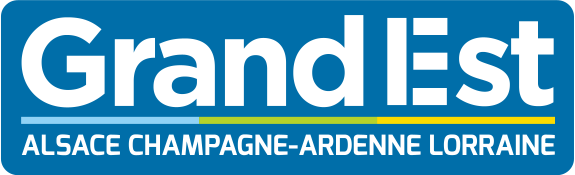

# Awesome Regions Grand Est Meetup  

> Une liste de tout les Meetups tech de la Region Grand-Est.

#### _Si vous voyez ici un meetup qui n'existe plus ou qui ne convient pas, veuillez créer une issue pour améliorer ce fichier. Merci !_

## Régions

- [Alsace](#alsace)
  - [Bas-Rhin](#bas-rhin)
  - [Haut-Rhin](#haut-rhin)
- [Champagne-Ardenne](#champagne-ardenne)
  - [Ardennes](#ardennes)
  - [Aube](#aube)
  - [Marne](#marne)
- [Lorraine](#lorraine)
  - [Meurthe et Moselle](#meurthe-et-moselle)
  - [Meuse](#meuse)
  - [Moselle](#moselle)
  - [Vosges](#vosges)

## Alsace

### Bas-Rhin

### Haut-Rhin

## Champagne-Ardenne

### Ardennes

### Aube

### Marne

## Lorraine

### Meurthe et Moselle

- [Apéro Web Nancy](https://aperowebnancy.netlify.app/) - Meetup mensuel toutes technos qui touchent le Web à Nancy

### Meuse

### Moselle

### Vosges

## Contribution

Vos contributions sont les bienvenues ! Veuillez d'abord consulter [le guide des contributions](CONTRIBUTING.md).

---

Si vous avez des questions sur cette liste, n'hésitez pas à me contacter [@rmaximedev](https://twitter.com/rmaximedev) sur Twitter ou à ouvrir une issue sur Github.
